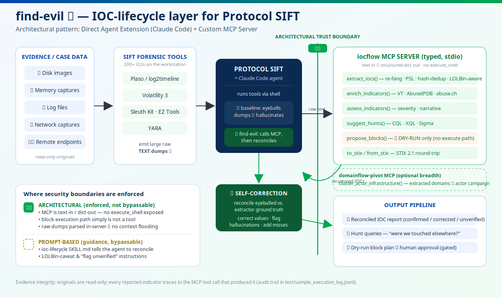

# find-evil

**An IOC-lifecycle layer for [Protocol SIFT](https://github.com/teamdfir/protocol-sift) that stops the agent hallucinating indicators.**

Submission for the SANS **FIND EVIL!** hackathon. Protocol SIFT turns the SANS SIFT
Workstation into a Claude Code agent with shell access to 200+ forensic tools. It works —
but because the agent reads large raw tool dumps and *guesses* at indicators, it
hallucinates: mis-read defanged domains, transposed IPs, benign LOLBins flagged as malware.

`find-evil` bolts the [`iocflow`](https://github.com/vinayvobbili/iocflow) IOC lifecycle onto
Protocol SIFT as a **custom MCP server** plus one **skill**. The agent stops guessing from
raw text and instead routes tool output through a deterministic, false-positive-defended
extractor, then **reconciles its own findings against ground truth** — catching and
correcting its hallucinations before they reach the report.

## Architecture



```
SIFT forensic tool (plaso / Volatility / YARA / Sleuth Kit)
        │  raw text dump
        ▼
Protocol SIFT agent (Claude Code)
        │  calls instead of eyeballing
        ▼
iocflow MCP server  ── extract_iocs ─ enrich ─ assess ─ suggest_hunts ─ propose_blocks(dry-run) ─ STIX
        │  structured, re-fanged, PSL-validated, FP-defended indicators
        ▼
Agent reconciles raw-read findings vs. extractor → corrects / flags hallucinations → report
```

- **Pattern:** Direct Agent Extension (Claude Code) **+** Custom MCP Server.
- **Security boundary is architectural, not prompt-based.** The MCP server is text-in /
  dict-out. It exposes no `execute_shell`; `propose_blocks` is dry-run by construction and
  the block-execution path is deliberately not exposed. The agent *cannot* spoliate
  evidence or push a block through these tools.

## What's here

- `.mcp.json` — registers the `iocflow` MCP server with Claude Code.
- `skills/ioc-lifecycle/SKILL.md` — the 6th Protocol SIFT skill: when a forensic tool
  emits text, extract → reconcile (self-correct) → hunt, instead of asserting by eye.
- `install.sh` — idempotent bolt-on; run after Protocol SIFT's own installer.
- `mcp_pivot/server.py` — *optional* secondary MCP server: one `cluster_actor_infrastructure`
  tool over [`domainflow`](https://github.com/vinayvobbili/domainflow) that pivots extracted
  domains into an actor's campaign by shared infrastructure (correlation breadth).
- `test/` — sample SIFT tool outputs and real agent execution logs (below).

## Install (on the SIFT Workstation)

```bash
# after protocol-sift's install.sh has run
curl -fsSL https://raw.githubusercontent.com/vinayvobbili/find-evil/main/install.sh | bash
claude mcp list   # expect: iocflow
```

## Proof: the agent self-corrects

`test/sample_execution_log.jsonl` is a real headless Claude Code run. The agent was handed
a junior analyst's IOC report with three planted errors and a raw Volatility `strings` dump.
Using only the `iocflow` MCP tools it:

- corrected `evil-domain.com` → `evil-domain.ru` (mis-read defanged TLD)
- corrected `185.220.101.50` → `185.220.101.5` (transposed octet)
- kept `powershell.exe` but flagged it as a LOLBin, not malware
- added 8 indicators the analyst missed (fallback C2, stager URL, payload, SHA256, exfil
  email, Log4Shell CVE, APT28/Fancy Bear, T1059.001 / T1190)
- generated 14 validated hunt queries (CrowdStrike CQL, Cortex XQL, Sigma)

Every finding traces back to a specific `mcp__iocflow__*` tool call in the log.

```bash
# reproduce locally (no SIFT image needed — any text with indicators works)
pip install 'iocflow[mcp]'
claude -p "Extract and reconcile the IOCs in this dump: $(cat test/volatility_strings.txt)" \
  --mcp-config .mcp.json --strict-mcp-config \
  --allowedTools mcp__iocflow__extract_iocs mcp__iocflow__suggest_hunts
```

## Optional: actor-infrastructure pivot

A second, secondary MCP server (`domainflow-pivot`) adds correlation breadth. After the agent
extracts domains from evidence, it can cluster them into an actor's campaign by *shared,
discriminating* infrastructure. In a real chained run (`test/sample_pivot_log.jsonl`), the
agent called `extract_iocs` then `cluster_actor_infrastructure` — and when the two C2 domains
had different IPs and no shared registrant, it **refused to fabricate a campaign link**,
distinguished host-side co-occurrence (same host/PID) from infrastructure linkage, and
recommended enriching first. Same anti-hallucination discipline, applied to correlation.

This layer is optional and clearly secondary to the iocflow core; drop it if a case isn't
domain/phishing-driven.

## License

MIT. Built on `iocflow` and `domainflow` (both MIT) by the same author.
